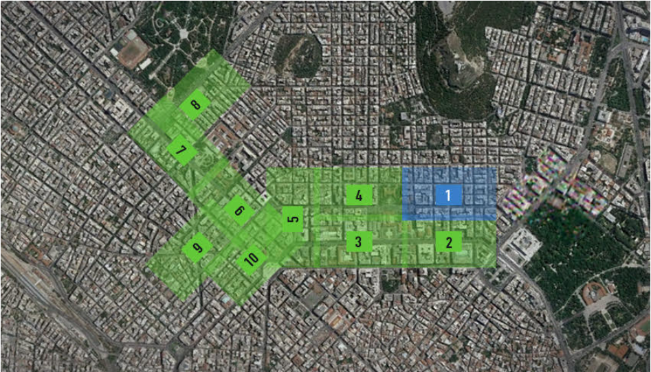

# Data Engineering: Data warehouse tech stack with MySQL, DBT, Airflow
[![Contributors][contributors-shield]][contributors-url]
[![Forks][forks-shield]][forks-url]
[![Stargazers][stars-shield]][stars-url]
[![Issues][issues-shield]][issues-url]
[![LinkedIn][linkedin-shield]][linkedin-url]

<!-- import an image -->

<!-- Table of contents -->
- [About](#about)
- [Objectives](#objectives)
- [Data](#data)
- [Contrbutors](#contrbutors)
- [Contributing](#contributing)
- [License](#license)

## About
A city traffic department wants to collect traffic data using swarm UAVs (drones) from a number of locations in the city and use the data collected for improving traffic flow in the city and for a number of other undisclosed projects. This project contains all the code base that can create a scalable data warehouse that will host the vehicle trajectory data extracted by analysing footage taken by UAVs and static roadside cameras at various intersections congested sides in the downtown area of Athens, Greece.
This project makes use of an ELT pipeline as the data load mechanism for loading data into the data warehouse since the ELT framework helps analytic engineers in the city traffic department setup transformation workflows on a need basis. Also, the goals of designing this data warehouse scalablity and ease of use.

## Objectives
The major objective behind this types of scalable data warehouse implementations is to help organizations(businesses) obtain critical intelligence based on public and private data collected about various transctions carried out internally within the organization and externally.

## Data
The [Data](https://open-traffic.epfl.ch/index.php/downloads/#1599047632450-ebe509c8-1330) used for this project is from open source dataset called PNeuma which is an open large-scale dataset of naturalistic trajectories of half a million vehicles that have been collected by a one-of-a-kind experiment by a swarm of drones in the congested downtown area of Athens, Greece. 

## Contrbutors
- Michael Getachew Abebe

## Contributing
Pull requests are welcome. For major changes, please open an issue first to discuss what you would like to change.

Please make sure to update tests as appropriate.

## License
[MIT](https://choosealicense.com/licenses/mit/)

[contributors-shield]: https://img.shields.io/github/contributors/michaelgetachew-abebe/sensor-data-ELT.svg?style=for-the-badge
[contributors-url]: https://github.com/michaelgetachew-abebe/Scalable-Data-Warehouse-UAVs/graphs/contributors